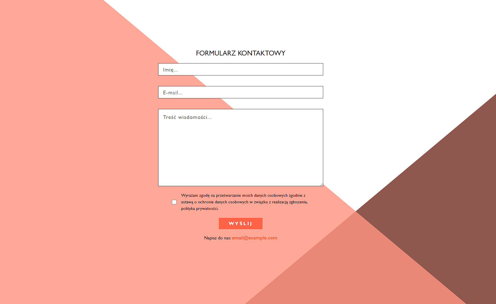

# Sending data from form by using **EmailJS**

This repository contains an example implementation of sending data from a form using the EmailJS service.\
It's a simple demonstration of how to integrate a form on a web page with the EmailJS service to send form data to a designated email address.

## Getting Started

1. Clone this repository to your device: `git clone https://github.com/JoannaPatyk/sending-data-from-the-form-by-emailJS.git`
2. Install dependencies: `npm install`
3. Run the project locally: `npm start`

This project was bootstrapped with [Create React App](https://github.com/facebook/create-react-app).

Open [http://localhost:3000](http://localhost:3000) to view it in your browser.

## Preparation

Before using this example, make sure you have an account on the EmailJS platform and have gathered necessary information such as your User ID and Template ID, which will be needed for configuration.

### **EmailJS Configuration**

1. Log in to your account on `EmailJS`.
2. Configure a new mail service and obtain your User ID.
3. Create a new email template and obtain its Template ID.
4. In the `App.js` file, update variables based on the information obtained from your EmailJS account.

## Technologies

-   HTML,
-   CSS,
-   React,

## Getting Started with Create React App

This project was bootstrapped with [Create React App](https://github.com/facebook/create-react-app).
